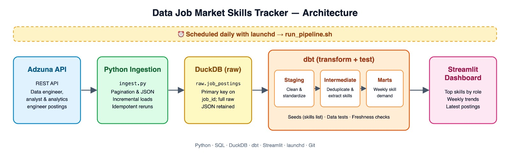
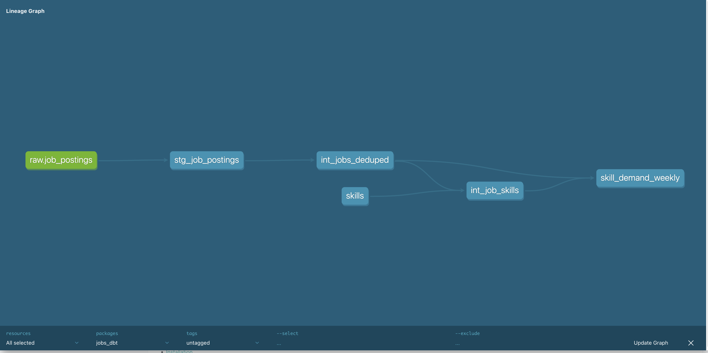
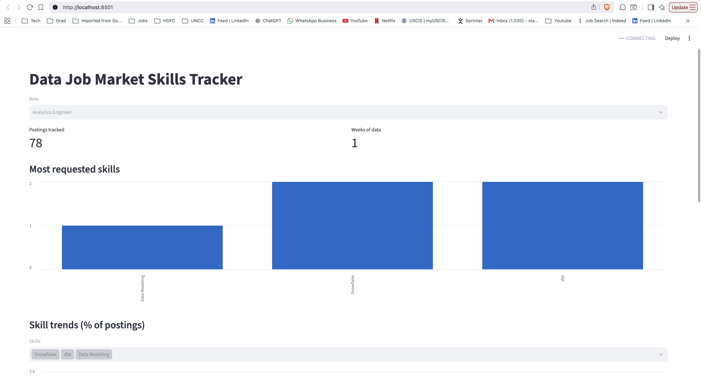

# Data Job Market Skills Tracker

An automated daily pipeline that collects data engineering and data analyst job postings, extracts in-demand technical skills, and tracks how demand changes over time.

## Tech stack
Python, REST API (Adzuna), DuckDB, dbt, SQL, Streamlit, launchd scheduling, Git

## How it works
1. **Ingestion:** `ingest.py` pulls recent postings daily from the Adzuna API and loads only new records into a raw DuckDB table.
2. **Transformation:** dbt cleans the data (staging), removes duplicate reposts and extracts skills (intermediate), and builds weekly skill-demand trends (marts).
3. **Testing:** dbt tests check uniqueness, nulls, accepted values, and data freshness on every run.
4. **Dashboard:** Streamlit shows top skills, skill trends, and the latest postings by role.

## Design decisions
- **Incremental, idempotent loading:** new postings are checked against existing job IDs, so reruns never create duplicates.
- **Raw data retained:** the full API response is stored as JSON, so new fields can be extracted later without re-fetching.
- **Two-level deduplication:** by job ID at ingestion, and by title, company, and location in dbt to catch reposted jobs.
- **Skill extraction:** word-boundary regex patterns avoid false matches (e.g. "Java" vs "JavaScript", "SQL" vs "NoSQL"). Ambiguous skills like "R" and "Go" were excluded.
- **Normalized metrics:** skills are measured as a percentage of postings so weeks with different posting volumes can be compared fairly.
- **Retry logic:** API requests retry with increasing wait times on timeouts and temporary server errors, and the pipeline waits for network connectivity before running.

## Limitations
- The Adzuna API returns a shortened job description, so skill counts reflect the title and summary rather than the full posting.

## Key findings
Findings will be added as data accumulates (pipeline running daily since September 2026).

## How to run
1. Get free API keys from developer.adzuna.com and add them to a `.env` file (`ADZUNA_APP_ID`, `ADZUNA_APP_KEY`).
2. `python3 -m venv venv && source venv/bin/activate`
3. `pip install duckdb dbt-duckdb streamlit pandas requests python-dotenv`
4. `python ingest.py`
5. `cd jobs_dbt && dbt build && cd ..`
6. `streamlit run app.py`

## Next steps
Airflow orchestration, Docker containerization, and migration to a cloud warehouse (BigQuery).
